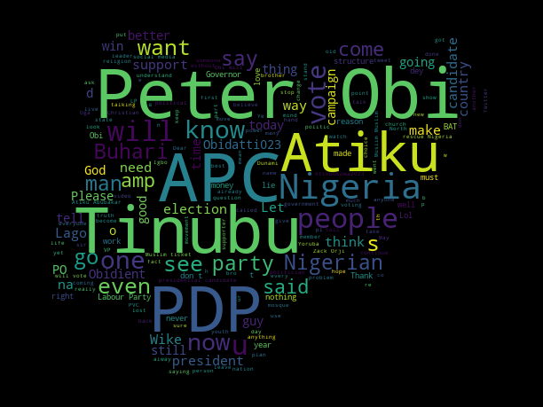

# Election-Analysis-using-unsupervised-learning
# Description 
Directly or indirectly the outcomes of every election affect every citizen
of a country.
Elections are an interesting thing to analyze since many people would like to know about matters surrounding their favourite candidates.Therefore , this prejoct seeks to show what exactly it is that Nigerians want from their leaders as well as predicting the winning candidate and by what margin they win.

Table of Contents

   1. About The Project
   2. Built With
   3. Getting Started
   4. Prerequisites
   5. Installation
   6. Usage
   7. Roadmap
   8. Contributing
   9. Contact
   10. Acknowledgments
   11. Visualization

# ABOUT THE PROJECT

This project is divided into two parts
Firstly, Analysing qualities of a good leader, An analysis done through people’s sentiments was done to know what people are saying concerning each candidate

The other part i analyzed which presidential candidate will win and by what margin. This part will not be for public consumption since it is very sensitive. It is intended that this part of the project will be handed to a NGO so that they can integrate it in their analysis. Access to this information will be restricted to a few people.

# Languages and tools

    Python
    Jupyter notebook
    Tweepy
    Scikit-Learn
    Seaborn
    streamlit
    
    
  # Getting Started

To get a local copy up and running follow these simple example steps.
Prerequisites

The prerequisites needed to successfully run this project are:

    Twitter API and Elevated Access.

    Twitter API and having an Elevated Developer Account helps scrape data from twitter. 

Installation

Below is an example of how you can instruct your audience on installing and setting up your app. This template doesn't rely on any external dependencies or services.

    Get a Twitter API at Twitter API

    Clone the repo

    Load all the datasets in your environment

    Install all the libraries used in the project

# Usage

This project is purely meant for self development. The Analyst has no political affiliation whatsoever

This project is divided into 2 notebooks. It follows the following order:

   Elections-Analysis,K-Means-Clustering and

   Presidential-prediction

# Roadmap

  Analyze, through people’s sentiments, what are the key things that the people wish most from their leaders.
    Predict which presidential candidate wins the election and by what margin. And also to determine if the candidate will win in the first round.
    Clustering the tweets to analyze the words that surround a particular presidential candidate

# Contributing

Contributions are what make the open source community such an amazing place to learn, inspire, and create. Any contributions you make are greatly appreciated.

If you have a suggestion that would make this better, please fork the repo and create a pull request. You can also simply open an issue with the tag "enhancement". Don't forget to give the project a star! Thanks again!

    Fork the Project
    Create your Feature Branch
    Commit your Changes 
    Push to the Branch
    Open a Pull Request

# ACKNOLEDGEMENT

We found the following resources and people helpful and would like to give credit to.

    Stackoverflow
    Towards Data Science
    Twitter Data Community
   Kiprop Amos : [TWITTER](https://twitter.com/AmosKiprop15 - amoskiprop5@gmail.com)
   
   Esther Ogutu : [Twitter](https://twitter.com/ogutu_esther - esther.ogutu@gmail.com]
    

# visualization

# Tweets WORDCLOUD

